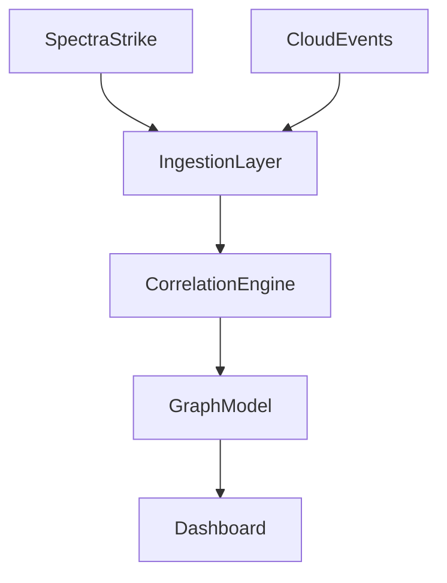
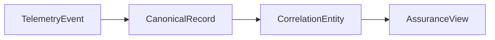
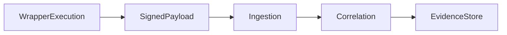
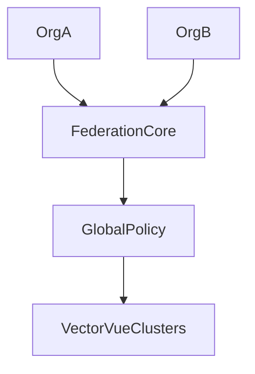
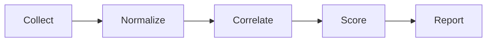

# Diagrams

## System Architecture

```mermaid
flowchart TD
SpectraStrike --> IngestionLayer
CloudEvents --> IngestionLayer
IngestionLayer --> CorrelationEngine
CorrelationEngine --> GraphModel
GraphModel --> Dashboard
```

## Data Model

```mermaid
flowchart LR
TelemetryEvent --> CanonicalRecord --> CorrelationEntity --> AssuranceView
```

## Wrapper Lifecycle Integration

```mermaid
flowchart LR
WrapperExecution --> SignedPayload --> Ingestion --> Correlation --> EvidenceStore
```

## Federation Model

```mermaid
flowchart TD
OrgA --> FederationCore
OrgB --> FederationCore
FederationCore --> GlobalPolicy
GlobalPolicy --> VectorVueClusters
```

## Evidence Lifecycle

```mermaid
flowchart LR
Collect --> Normalize --> Correlate --> Score --> Report
```
