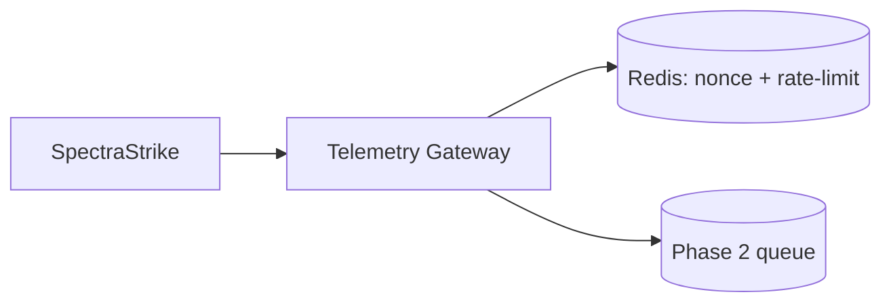

<!-- NYXERA_BRANDING_HEADER_START -->

  

  <a href="https://docs.vectorvue.nyxera.cloud">Docs</a> |
  <a href="https://vectorvue.nyxera.cloud">VectorVue</a> |
  <a href="https://nexus.nyxera.cloud">Nexus</a> |
  <a href="https://nyxera.cloud">Nyxera Labs</a>

<!-- NYXERA_BRANDING_HEADER_END -->

# Phase 1 Sprint 1.2 - Payload Security Layer Architecture

## Summary
The telemetry gateway now enforces signed payload verification, Redis-backed replay defense, and operator rate limiting before telemetry acceptance.

## Threat Model
- Telemetry is untrusted until identity, signature, freshness, and replay checks all pass.

## Attack Vectors Considered
- Signature forgery.
- Expired timestamp replay.
- Nonce reuse.
- Burst flooding by operator identifier.

## Mitigations Implemented
- Ed25519 signature validation pipeline.
- Header/body timestamp and nonce consistency checks.
- Redis-backed nonce uniqueness TTL store.
- Redis-backed per-operator per-minute counters with 429 enforcement.

## Residual Risk
- Shared Redis availability is a dependency for strict fail-closed ingest.

## Future Improvements
- Isolate security cache Redis DB and ACL from analytics workloads.
- Add circuit-breaker and queue handoff after rate-limit threshold crossings.

## Architecture Diagram

```mermaid
flowchart LR
  SS[SpectraStrike]
  TG[Telemetry Gateway]
  R[(Redis: nonce + rate-limit)]
  Q[(Phase 2 queue)]

  SS --> TG
  TG --> R
  TG --> Q
```

<!-- NYXERA_BRANDING_FOOTER_START -->

---

  

  2026 VectorVue by Nyxera Labs. All rights reserved.

  <a href="https://docs.vectorvue.nyxera.cloud">Docs</a> |
  <a href="https://vectorvue.nyxera.cloud">VectorVue</a> |
  <a href="https://nexus.nyxera.cloud">Nexus</a> |
  <a href="https://nyxera.cloud">Nyxera Labs</a>

<!-- NYXERA_BRANDING_FOOTER_END -->
