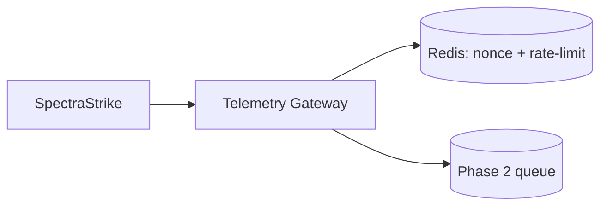

# Phase 1 Sprint 1.2 - Payload Security Layer Architecture

## Summary
The telemetry gateway now enforces signed payload verification, Redis-backed replay defense, and operator rate limiting before telemetry acceptance.

## Threat Model
- Telemetry is untrusted until identity, signature, freshness, and replay checks all pass.

## Attack Vectors Considered
- Signature forgery.
- Expired timestamp replay.
- Nonce reuse.
- Burst flooding by operator identifier.

## Mitigations Implemented
- Ed25519 signature validation pipeline.
- Header/body timestamp and nonce consistency checks.
- Redis-backed nonce uniqueness TTL store.
- Redis-backed per-operator per-minute counters with 429 enforcement.

## Residual Risk
- Shared Redis availability is a dependency for strict fail-closed ingest.

## Future Improvements
- Isolate security cache Redis DB and ACL from analytics workloads.
- Add circuit-breaker and queue handoff after rate-limit threshold crossings.

## Architecture Diagram

