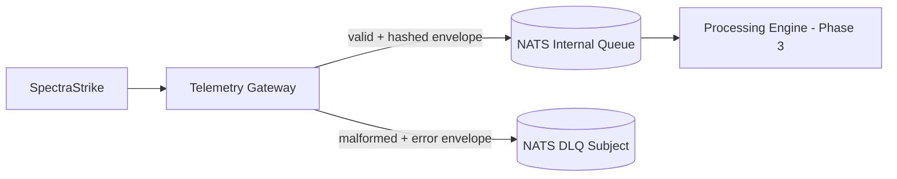

# Phase 2 Sprint 2.1 - Queue Layer Architecture

## Summary
Telemetry gateway now publishes accepted messages to an internal NATS subject and routes malformed payloads to a dedicated dead-letter subject.

## Threat Model
- Queue ingress must remain internal-only.
- Queue payload integrity must be verifiable.

## Attack Vectors Considered
- Queue endpoint exposure.
- Malformed payload poisoning.
- Payload mutation between producer and consumer.

## Mitigations Implemented
- Added `nats` service without host port exposure.
- Added `telemetry_private` internal network path for gateway-to-queue.
- Added dead-letter routing for invalid JSON/schema payloads.
- Added SHA-256 integrity hash field in queued envelopes.

## Residual Risk
- Downstream verification of integrity hash is deferred.

## Future Improvements
- Queue authn/authz and subject-level policy enforcement.
- Consumer acknowledgements with integrity attestations.

## Architecture Diagram

