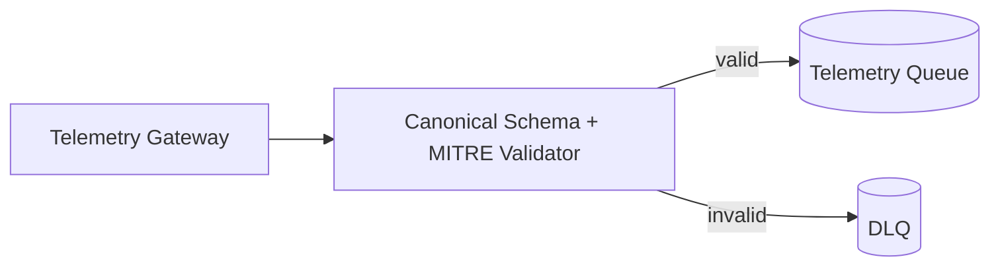

# Phase 3 Sprint 3.1 - Processing Schema Architecture

## Summary
A dedicated telemetry processing validator package now enforces strict canonical payload schema and MITRE mapping validity before queue publish.

## Threat Model
- Prevent malformed or semantically invalid telemetry from reaching processing stages.

## Attack Vectors Considered
- Additional property injection.
- Missing canonical fields.
- Invalid ATT&CK technique/tactic identifiers.

## Mitigations Implemented
- New `services/telemetry_processing/validator.py` module.
- Canonical payload model with strict field allow-list.
- MITRE format validators integrated into ingest flow.
- DLQ routing for canonical schema failures.

## Residual Risk
- Schema evolution/versioning is not yet formalized.

## Future Improvements
- Add schema version negotiation and migration tooling.

## Architecture Diagram

