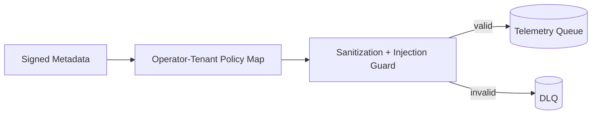

# Phase 3 Sprint 3.2 - Tenant Isolation Architecture

## Summary
Telemetry ingest now requires signed tenant metadata consistency and enforces strict operator-to-tenant mapping, with canonical field sanitization before queue handoff.

## Threat Model
- Treat tenant identity claims as untrusted unless validated against signed metadata and explicit mapping policy.

## Attack Vectors Considered
- Cross-tenant claim injection.
- Metadata field tampering.
- HTML/JS payload contamination.
- SQL-like injection tokens in processing payloads.

## Mitigations Implemented
- Signed metadata structure (`tenant_id`, `operator_id`, `campaign_id`) is validated and must match top-level envelope.
- Operator-to-tenant mapping is validated against explicit config map.
- Canonical text fields are sanitized and screened for injection patterns.

## Residual Risk
- Mapping state distribution is static per environment.

## Future Improvements
- Signed dynamic policy distribution for tenant map updates.
- Runtime attestation of mapping policy versions.

## Architecture Diagram

