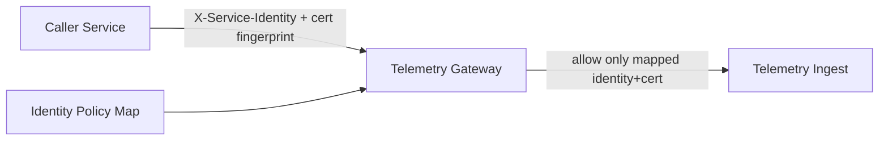

# Phase 5 Sprint 5.1 - Zero Trust Service Identity Architecture

## Summary
Service authentication now uses explicit service identity + certificate fingerprint mapping instead of a single shared trust value.

## Threat Model
- Assume no internal service is trusted by default.
- Require explicit identity and cryptographic certificate binding per caller.

## Attack Vectors Considered
- Identity spoofing by unknown service ID.
- Certificate mismatch for valid identity.
- Shared static trust variable misuse.

## Mitigations Implemented
- Identity map enforcement (`service_id -> cert_sha256`).
- Identity cert/key/CA artifacts configured per service container.
- Gateway startup fails if local identity artifacts are missing.

## Residual Risk
- Identity-policy lifecycle management remains environment-based.

## Future Improvements
- SPIFFE/SPIRE or mesh-based workload identities.
- Centralized policy signing and rollout validation.

## Architecture Diagram

