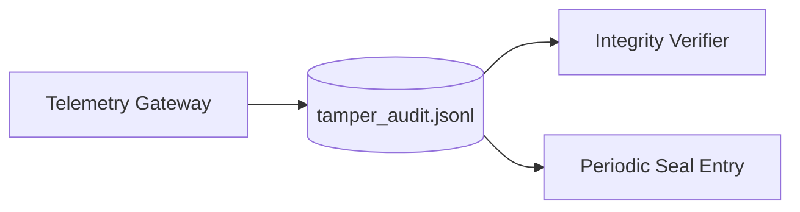

# Phase 6 Sprint 6.1 - Immutable Logging Architecture

## Summary
A tamper-evident append-only log chain now records telemetry gateway outcomes and periodically emits seal snapshots.

## Threat Model
- Assume history rewrite attempts may occur post-incident.

## Attack Vectors Considered
- Entry modification.
- Hash-link bypass.
- Silent log truncation.

## Mitigations Implemented
- Append-only record writes.
- Previous-hash linkage across entries.
- Deterministic entry hash verification.
- Periodic seal entries (`log.sealed`) for checkpointing.

## Residual Risk
- Local-only chain without external anchoring.

## Future Improvements
- Remote chain anchoring and audit attestation workflows.

## Architecture Diagram

