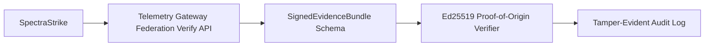

# Phase 7 Sprint 7.1 - Federation Architecture

## Summary
Introduced a formal signed evidence bundle contract and proof-of-origin verification flow for SpectraStrike federation.

## Threat Model
- Federation payloads are untrusted until signature verification succeeds.

## Attack Vectors Considered
- Origin spoofing.
- Signature forgery.
- Hidden unvalidated fields.

## Mitigations Implemented
- Dedicated federation schema package with strict field allow-list.
- Canonical message hash and Ed25519 signature verification.
- Verification API integrated into telemetry gateway, protected by service identity auth.

## Residual Risk
- Replay/freshness constraints are limited to current signature input and can be tightened with explicit replay cache for bundle endpoint.

## Future Improvements
- Introduce replay nonce registry specifically for federation verify endpoint.

## Architecture Diagram

