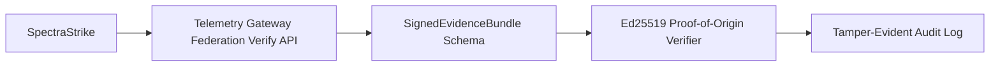

<!-- NYXERA_BRANDING_HEADER_START -->

  

  <a href="https://docs.vectorvue.nyxera.cloud">Docs</a> |
  <a href="https://vectorvue.nyxera.cloud">VectorVue</a> |
  <a href="https://nexus.nyxera.cloud">Nexus</a> |
  <a href="https://nyxera.cloud">Nyxera Labs</a>

<!-- NYXERA_BRANDING_HEADER_END -->

# Phase 7 Sprint 7.1 - Federation Architecture

## Summary
Introduced a formal signed evidence bundle contract and proof-of-origin verification flow for SpectraStrike federation.

## Threat Model
- Federation payloads are untrusted until signature verification succeeds.

## Attack Vectors Considered
- Origin spoofing.
- Signature forgery.
- Hidden unvalidated fields.

## Mitigations Implemented
- Dedicated federation schema package with strict field allow-list.
- Canonical message hash and Ed25519 signature verification.
- Verification API integrated into telemetry gateway, protected by service identity auth.

## Residual Risk
- Replay/freshness constraints are limited to current signature input and can be tightened with explicit replay cache for bundle endpoint.

## Future Improvements
- Introduce replay nonce registry specifically for federation verify endpoint.

## Architecture Diagram

```mermaid
flowchart LR
  SS[SpectraStrike]
  GW[Telemetry Gateway Federation Verify API]
  SCH[SignedEvidenceBundle Schema]
  VFY[Ed25519 Proof-of-Origin Verifier]
  AUD[Tamper-Evident Audit Log]

  SS --> GW
  GW --> SCH
  SCH --> VFY
  VFY --> AUD
```

<!-- NYXERA_BRANDING_FOOTER_START -->

---

  

  2026 VectorVue by Nyxera Labs. All rights reserved.

  <a href="https://docs.vectorvue.nyxera.cloud">Docs</a> |
  <a href="https://vectorvue.nyxera.cloud">VectorVue</a> |
  <a href="https://nexus.nyxera.cloud">Nexus</a> |
  <a href="https://nyxera.cloud">Nyxera Labs</a>

<!-- NYXERA_BRANDING_FOOTER_END -->
