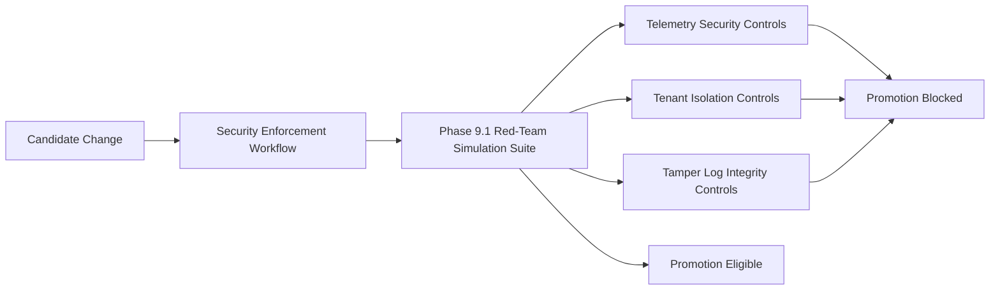

# Phase 9 Sprint 9.1 - Red Team Validation Architecture

## Summary
Added a dedicated red-team simulation suite as a release-gating security control within CI.

## Threat Model
- CI must treat incoming changes as untrusted and reject any build that permits critical attack-path regressions.

## Attack Vectors Considered
- Replay and signature bypass.
- Service identity spoofing / MITM fingerprint mismatch.
- Cross-tenant access.
- Queue poisoning.
- Tamper log integrity bypass.
- Rate limit exhaustion.

## Mitigations Implemented
- Phase 9.1 simulation suite executes adversarial request and tampering scenarios.
- Security workflow now includes red-team simulations in required regression gate.
- Promotion gate remains fail-closed when any simulation test fails.

## Residual Risk
- This sprint validates known controls; emerging vectors still require periodic suite expansion.

## Future Improvements
- Add attack replay corpus and scenario versioning.
- Add federation-specific replay and key-rotation adversarial tests.

## Architecture Diagram

