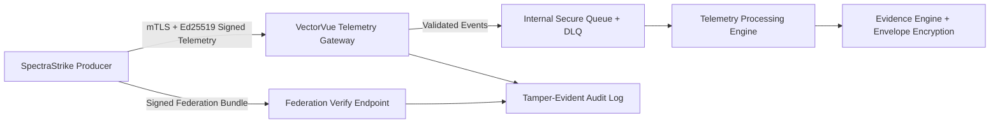
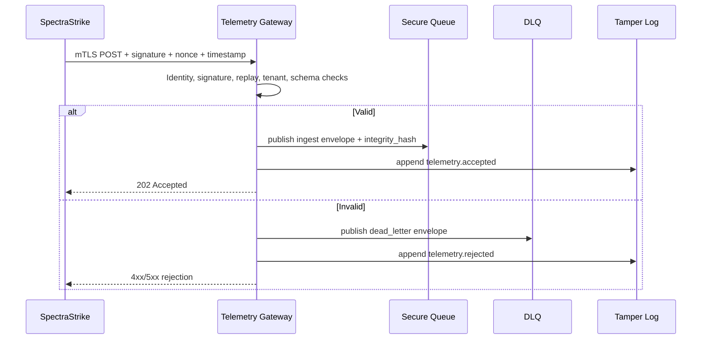
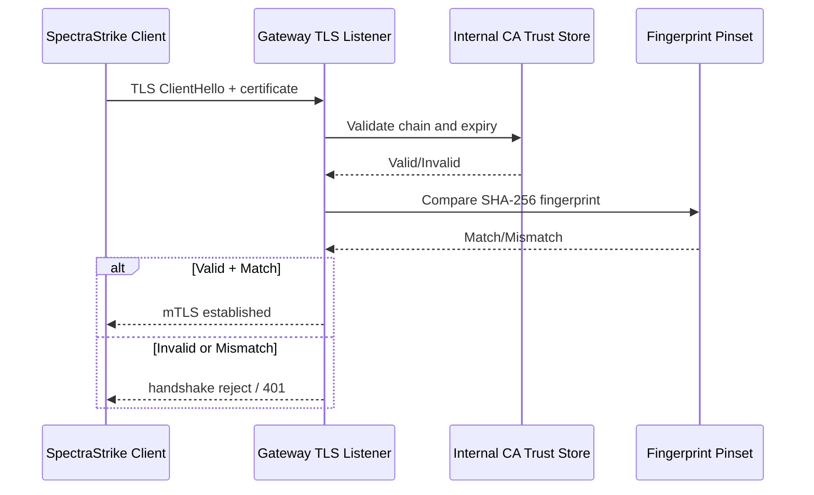
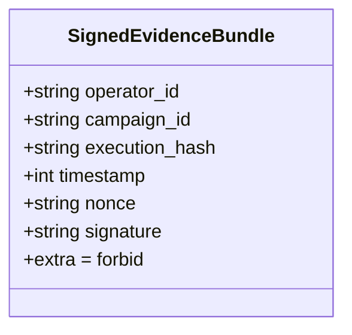
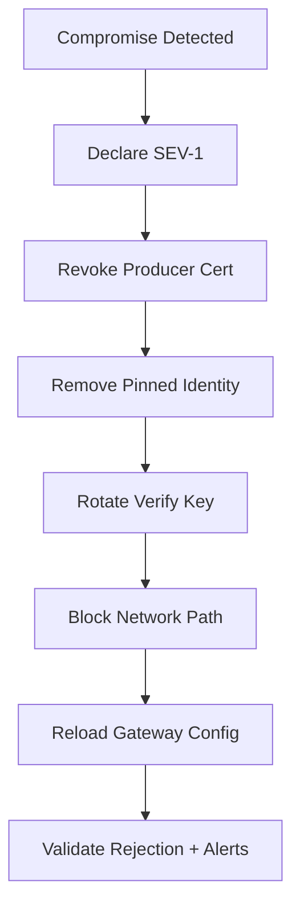
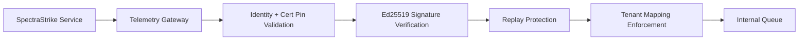

# SpectraStrike ↔ VectorVue Secure Integration Manual

Document Version: 1.0  
Last Updated: February 26, 2026  
Audience: Security Engineering, Platform Engineering, DevOps, SRE

## 1. Executive Overview
This document defines the production integration pattern between SpectraStrike and VectorVue after the completed security expansion (Phases 0-9). The integration is designed as zero-trust federation: no implicit network trust, no shared secrets between systems, mandatory mTLS for transport, mandatory Ed25519 payload signatures for telemetry authenticity, cryptographic tenant isolation, tamper-evident logging, and fail-closed CI/CD enforcement.

Threat Model:
- Attack vector: Insecure direct ingestion or trust bypass from external producer.
- Impact: Unauthorized telemetry injection, tenant contamination, false evidence creation.
- Mitigation: Internal-only gateway, mTLS identity binding, signature verification, replay defense, strict schema and tenant mapping.
- Residual risk: Misconfiguration of required checks in branch protection can weaken enforcement if governance fails.

## 2. Architecture Overview
VectorVue uses an internal telemetry gateway as the only accepted ingress path for SpectraStrike telemetry. Gateway controls enforce identity, payload authenticity, freshness, tenant mapping, queue integrity, and tamper-evident audit trails.



Threat Model:
- Attack vector: Bypass gateway and push telemetry directly into processing path.
- Impact: Unvalidated events alter scoring/evidence.
- Mitigation: Gateway as trust choke-point; internal queue not publicly exposed.
- Residual risk: Host-level compromise can still abuse internal network channels.

## 3. Trust Model
Trust is explicit and per-request.

1. Transport trust: mTLS with service identity certificate pinning.
2. Message trust: Ed25519 signature verification using configured SpectraStrike public key.
3. Freshness trust: timestamp skew validation + nonce replay lock.
4. Tenant trust: signed metadata equality checks + operator-to-tenant mapping.
5. Processing trust: strict schema + MITRE mapping + sanitization.
6. Cognitive trust: signed feedback responses bound to tenant and replay-safe nonce/timestamp.

Threat Model:
- Attack vector: Assume internal source is trusted without proof.
- Impact: Lateral movement can impersonate producer.
- Mitigation: Every request must satisfy identity + signature + freshness + tenant constraints.
- Residual risk: Insider with valid private key remains authorized until revoked.

## 4. Cryptographic Federation Model
Federation bundles are accepted only when signed evidence envelope fields validate against canonical signature input.

Canonical fields:
- `operator_id`
- `campaign_id`
- `execution_hash`
- `timestamp`
- `nonce`
- `signature`

Threat Model:
- Attack vector: Bundle tampering after signing or forged sender identity.
- Impact: Corrupt downstream evidence and audit outcomes.
- Mitigation: Strict bundle schema (`extra=forbid`) + Ed25519 proof-of-origin verification.
- Residual risk: Freshness/replay controls for federation bundles should be tightened with dedicated nonce cache.

## 5. Secure Telemetry Flow
1. SpectraStrike prepares canonical JSON telemetry payload.
2. SpectraStrike signs message: `"{timestamp}.{nonce}." + raw_json` using Ed25519 private key.
3. SpectraStrike sends request over mTLS with required headers.
4. Gateway validates:
   - service identity + cert fingerprint pin
   - signature integrity
   - timestamp skew and nonce uniqueness
   - operator rate limits
   - strict schema and MITRE mappings
   - signed tenant metadata and operator mapping
5. Gateway routes accepted payload to secure queue with integrity hash.
6. Invalid payloads are sent to DLQ with rejection metadata.
7. All accept/reject outcomes are appended to tamper-evident audit log.



Threat Model:
- Attack vector: Malformed payload intended to poison queue or parser.
- Impact: Processing faults, dropped data, hidden exploitation attempts.
- Mitigation: strict validation + DLQ routing + logged reject reasons.
- Residual risk: DLQ flood volume can increase storage pressure.

## 5.6 Cognitive Feedback Flow (Sprint 31 Alignment)
1. SpectraStrike sends execution graph metadata to `/internal/v1/cognitive/execution-graph`.
2. Gateway applies mTLS identity, signature verification, and replay checks.
3. VectorVue stores graph metadata under tenant scope.
4. SpectraStrike queries `/internal/v1/cognitive/feedback/adjustments/query`.
5. Gateway returns tenant-scoped adjustments with response signature, nonce, and signed timestamp.
6. SpectraStrike verifies signature + replay window and rejects unsigned/forged/replayed responses.
7. Only verified adjustments are bound into policy evaluation context.

Required feedback item fields:
- `tenant_id`
- `execution_fingerprint`
- `target_urn`
- `action`
- `confidence`
- `rationale`
- `timestamp`
- `schema_version`

## 6. Identity & Certificate Management
Identity model:
- Each service uses unique certificate identity.
- Gateway maps allowed service IDs to pinned certificate SHA-256 fingerprints.
- Cert artifacts required on startup; missing artifacts fail service health.

Required controls:
- Certificates are issued from internal CA under dual control.
- Short-lived certs are preferred (<=90 days).
- Pinsets are explicit, not wildcard.

Threat Model:
- Attack vector: MITM using untrusted cert or spoofed service name.
- Impact: False producer accepted.
- Mitigation: mTLS + cert fingerprint pinning + non-empty identity allowlist.
- Residual risk: Stale pinsets during rotation can cause outage if not coordinated.

## 7. Deployment Topology
Deployment zones:
- Zone A: SpectraStrike producer network.
- Zone B: VectorVue private integration network.
- Zone C: Internal queue and processing network.

Topology requirements:
- No public exposure of queue endpoints.
- Gateway ingress limited to approved source CIDRs and mTLS client certs.
- Processing services accept only internal network traffic.

Threat Model:
- Attack vector: Public path to internal queue/processor.
- Impact: Direct unvalidated event injection.
- Mitigation: Network ACLs + internal DNS + no external queue listeners.
- Residual risk: Cloud misconfiguration remains possible; enforce IaC policy checks.

## 8. Secure Configuration Steps
1. Generate/issue service certificates for SpectraStrike producer and VectorVue gateway.
2. Register SpectraStrike service identity and pinned fingerprint in gateway config.
3. Configure gateway Ed25519 public key for signature verification.
4. Enable mTLS and signature-required flags (`VV_TG_REQUIRE_MTLS=1`, `VV_TG_REQUIRE_PAYLOAD_SIGNATURE=1`).
5. Configure nonce backend and TTL; configure rate-limit backend and threshold.
6. Configure operator-to-tenant mapping and signed metadata enforcement.
7. Configure queue backend (internal), subjects, and DLQ.
8. Enable tamper log path and seal interval.
9. Run CI security enforcement workflow and red-team suite before merge.

Threat Model:
- Attack vector: Insecure defaults or omitted critical controls.
- Impact: Silent acceptance of unsigned/untrusted payloads.
- Mitigation: explicit fail-closed settings + policy gate in CI.
- Residual risk: Manual runtime changes outside IaC can drift from approved baseline.

## 9. SpectraStrike Configuration
Example `config.yaml`:

```yaml
spectrastrike:
  producer:
    endpoint: https://vectorvue-telemetry-gateway.internal/internal/v1/telemetry
    service_identity: spectrastrike-producer
    mtls:
      cert_path: /etc/spectrastrike/certs/client.crt
      key_path: /etc/spectrastrike/certs/client.key
      ca_path: /etc/spectrastrike/certs/ca.crt
      verify_peer: true
    signing:
      algorithm: ed25519
      private_key_path: /etc/spectrastrike/keys/telemetry_ed25519.key
      key_id: spectrastrike-ed25519-2026q1
    replay:
      nonce_length: 24
      timestamp_format: unix_epoch_seconds
      max_clock_skew_seconds: 30
    retry:
      max_attempts: 3
      backoff_ms: 500
      jitter_ms: 250
```

Threat Model:
- Attack vector: Producer sends unsigned or stale telemetry due to weak local config.
- Impact: High reject rates; potential data loss.
- Mitigation: enforce signing and timestamp generation in producer pipeline.
- Residual risk: Producer clock drift can trigger false rejection.

## 10. VectorVue Configuration
Example gateway `config.yaml` representation (maps to environment variables):

```yaml
vectorvue:
  telemetry_gateway:
    require_mtls: true
    require_payload_signature: true
    allowed_clock_skew_seconds: 30
    nonce_ttl_seconds: 120
    nonce_backend: redis
    redis_url: redis://vectorvue-redis.internal:6379/0
    rate_limit_per_minute: 120
    rate_limit_backend: redis
    queue_backend: nats
    nats_url: nats://vectorvue-nats.internal:4222
    queue_subject: vectorvue.telemetry.ingest
    dlq_subject: vectorvue.telemetry.dlq
    spectrastrike_ed25519_public_key_b64: <base64-32-byte-public-key>
    allowed_service_identities:
      spectrastrike-producer: aaaaaaaaaaaaaaaaaaaaaaaaaaaaaaaaaaaaaaaaaaaaaaaaaaaaaaaaaaaaaaaa
    operator_tenant_map:
      op-001: 10000000-0000-0000-0000-000000000001
```

Threat Model:
- Attack vector: Runtime config drift disables verification controls.
- Impact: Unauthorized payload acceptance.
- Mitigation: CI policy gate validates security flags and guard presence.
- Residual risk: Runtime override outside deployment pipeline can still bypass policy unless admission controls exist.

## 11. Telemetry Gateway Setup
1. Deploy gateway service in private subnet.
2. Mount identity cert/key/CA and verify file permissions (`0400` for keys).
3. Inject security environment variables from secret manager/config service.
4. Enable liveness/readiness checks and startup validation.
5. Restrict ingress to SpectraStrike egress CIDRs + mTLS.
6. Bind queue and Redis dependencies over internal TLS where available.

Threat Model:
- Attack vector: Gateway starts with incomplete security artifacts.
- Impact: Fails open or unstable ingress path.
- Mitigation: startup hard-fail for missing cert/key/CA/public key values.
- Residual risk: Dependency outages can produce temporary reject spikes.

## 12. mTLS Configuration Steps
Certificate generation example (OpenSSL):

```bash
# 1) Root CA
openssl genrsa -out ca.key 4096
openssl req -x509 -new -nodes -key ca.key -sha256 -days 3650 \
  -subj "/CN=VectorVue-Internal-CA" -out ca.crt

# 2) SpectraStrike client cert
openssl genrsa -out spectrastrike.key 2048
openssl req -new -key spectrastrike.key -subj "/CN=spectrastrike-producer" -out spectrastrike.csr
openssl x509 -req -in spectrastrike.csr -CA ca.crt -CAkey ca.key -CAcreateserial \
  -out spectrastrike.crt -days 90 -sha256

# 3) Gateway server cert
openssl genrsa -out gateway.key 2048
openssl req -new -key gateway.key -subj "/CN=vectorvue-telemetry-gateway.internal" -out gateway.csr
openssl x509 -req -in gateway.csr -CA ca.crt -CAkey ca.key -CAcreateserial \
  -out gateway.crt -days 90 -sha256

# 4) Fingerprint pin material
openssl x509 -in spectrastrike.crt -noout -fingerprint -sha256
```

Certificate validation sequence:



Threat Model:
- Attack vector: Stolen certificate or rogue CA issuance.
- Impact: Producer impersonation.
- Mitigation: private CA control, short cert validity, pinset checks, revocation process.
- Residual risk: Delay in revocation propagation.

## 13. Signature Verification Model
Ed25519 signing flow example (producer):

```python
import base64
import json
from nacl.signing import SigningKey

payload = {...}
raw = json.dumps(payload, separators=(",", ":")).encode("utf-8")
timestamp = str(payload["timestamp"])
nonce = payload["nonce"]
message = f"{timestamp}.{nonce}.".encode("utf-8") + raw

sk = SigningKey(open("/etc/spectrastrike/keys/telemetry_ed25519.key", "rb").read())
signature = sk.sign(message).signature
signature_b64 = base64.b64encode(signature).decode("utf-8")
```

Validation middleware pseudo-code:

```text
function verify_request(req, raw_body):
  enforce_header("X-Service-Identity")
  enforce_header("X-Client-Cert-Sha256")
  enforce_header("X-Telemetry-Timestamp")
  enforce_header("X-Telemetry-Nonce")
  enforce_header("X-Telemetry-Signature")

  enforce_mtls_identity_and_pin(req.service_identity, req.cert_fp)

  ts = parse_int(req.timestamp)
  require(abs(now() - ts) <= allowed_clock_skew_seconds)

  signature = base64_decode(req.signature)
  message = bytes(f"{ts}.{req.nonce}.") + raw_body
  verify_ed25519(signature, message, configured_public_key)

  register_nonce_or_reject(ts, req.nonce)
  return OK
```

Threat Model:
- Attack vector: Signature substitution or unsigned payload replay.
- Impact: Forged telemetry accepted.
- Mitigation: canonical message construction + strict signature verify + mandatory headers.
- Residual risk: Public key misconfiguration causes false reject/accept if governance is weak.

## 14. Replay Protection Mechanism
Mechanism:
- Validate timestamp within bounded skew window.
- Construct nonce key from `sha256("{timestamp}:{nonce}")`.
- Atomically register nonce with TTL in Redis or in-memory fallback for tests.
- Reject if nonce exists.

Threat Model:
- Attack vector: Re-submit valid signed payload to duplicate effects.
- Impact: Event inflation, false incident amplification.
- Mitigation: nonce uniqueness and time window enforcement.
- Residual risk: Memory backend is not multi-instance safe; Redis backend required in production.

## 15. Tenant Isolation Model
Tenant enforcement path:
1. `signed_metadata.tenant_id/operator_id/campaign_id` must match payload top-level fields.
2. `operator_id` must map to approved tenant via gateway operator map.
3. On mismatch, reject with `401` or `403` and append audit entry.
4. Downstream repositories enforce tenant-scoped query guards.

Threat Model:
- Attack vector: Cross-tenant injection by modifying tenant IDs.
- Impact: Data contamination and confidentiality breach.
- Mitigation: signed metadata equality + operator-to-tenant allowlist + tenant-scoped persistence guards.
- Residual risk: Mapping errors in config can deny valid traffic; requires change-control review.

## 16. Evidence Encryption Model
Evidence blob encryption:
- Envelope encryption with per-tenant derived KEK.
- Data encryption key (DEK) generated per payload.
- DEK wrapped using tenant KEK; payload encrypted with DEK.
- Root keys sourced via HSM provider abstraction.

Threat Model:
- Attack vector: Storage compromise exposing evidence data.
- Impact: Sensitive evidence disclosure.
- Mitigation: encryption at rest + tenant-bound AAD + key hierarchy isolation.
- Residual risk: If root key material is env-backed (non-HSM), hardware guarantees are reduced.
- Security deficiency: **SD-01 (Medium)**. HSM enforcement is abstracted but not guaranteed by runtime policy in all environments.

## 17. Tamper-Evident Logging Model
Audit logging model:
- Append-only JSONL records.
- Each record includes `previous_hash` and deterministic `entry_hash`.
- Periodic seal entries (`log.sealed`) checkpoint chain state.
- Integrity verification returns precise break reason.

Threat Model:
- Attack vector: Post-incident log rewrite or deletion.
- Impact: Loss of forensic confidence.
- Mitigation: hash-chain integrity checks and seal checkpoints.
- Residual risk: Local file deletion by privileged host access is still possible.
- Security deficiency: **SD-02 (High)**. No mandatory remote immutable anchoring/WORM sink for seals in baseline deployment.

## 18. Federation Protocol Specification
Envelope structure (signed evidence bundle):



Protocol rules:
- Fields outside schema are rejected.
- Signature verification uses canonical concatenation:
  - `operator_id|campaign_id|execution_hash|timestamp|nonce`
- Verification endpoint requires service identity authentication.

Threat Model:
- Attack vector: Bundle extension with hidden fields.
- Impact: Signed-content ambiguity and parser confusion.
- Mitigation: strict schema and canonical sign/verify contract.
- Residual risk: Federation nonce replay protection can be strengthened.

## 19. Error Handling & Rejection Cases
Primary rejection classes:
- `401 Unauthorized`: missing/invalid mTLS identity, cert mismatch, missing signature headers, invalid signature, metadata mismatch, timestamp skew.
- `403 Forbidden`: operator not mapped to tenant, tenant mapping violation.
- `409 Conflict`: replay detected (nonce reused).
- `422 Unprocessable Entity`: schema validation, MITRE mapping, sanitization/injection block failures.
- `429 Too Many Requests`: operator burst anomaly.
- `503 Service Unavailable`: Redis/queue/DLQ backend unavailable.

Threat Model:
- Attack vector: Error ambiguity allows attacker probing without detection.
- Impact: Control bypass attempts become stealthy.
- Mitigation: deterministic status codes + tamper-evident rejected-event logging.
- Residual risk: Highly verbose external error details can aid reconnaissance; keep external messages bounded.

## 20. Failure & Recovery Scenarios
Scenario matrix:
1. Redis nonce store unavailable -> gateway returns `503`; trigger incident and failover.
2. Queue unavailable -> publish failure returns `503`; replay-safe retries allowed from producer.
3. High reject rate due to cert expiry -> rotate certs and revalidate pinset.
4. Signature key mismatch after rotation -> deploy updated public key and rerun signed handshake checks.

Threat Model:
- Attack vector: Dependency outage exploited to force operational bypass.
- Impact: Temptation to disable controls under pressure.
- Mitigation: explicit policy: no insecure fallback; fail closed and execute recovery playbook.
- Residual risk: Availability impact during prolonged dependency outages.

## 21. Revocation & Kill Switch Procedure
Kill switch objective: immediately stop SpectraStrike-to-VectorVue federation when compromise is suspected.

Procedure:
1. Open `SEV-1` incident and assign Security Commander + Platform Commander.
2. Revoke SpectraStrike producer cert at CA and distribute CRL/OCSP updates.
3. Remove producer identity from `allowed_service_identities` pinset.
4. Rotate gateway Ed25519 public key to reject previously trusted signatures.
5. Apply network ACL deny rule from SpectraStrike egress CIDRs.
6. Run gateway config reload/redeploy.
7. Validate all inbound producer attempts are rejected (`401/403`).
8. Preserve tamper-evident logs and evidence for forensics.

Kill-switch revocation flow:



Threat Model:
- Attack vector: Delayed revocation after key/cert theft.
- Impact: Continued unauthorized telemetry ingress.
- Mitigation: dual-plane revocation (cert + pinset + network + key rotation).
- Residual risk: Control-plane propagation delay.
- Security deficiency: **SD-03 (Medium)**. No single atomic kill-switch API; revocation requires orchestrated multi-step operation.

## 22. Key Rotation Procedure
Rotation targets:
- SpectraStrike Ed25519 signing keys.
- Gateway trust public keys.
- mTLS certificates.

Procedure:
1. Generate new Ed25519 keypair in secure key store.
2. Publish new public key to VectorVue config under approved change window.
3. Deploy producer update to sign with new private key.
4. Run dual-validation canary (old/new keys where supported).
5. Decommission old key after cutover confirmation.
6. Rotate mTLS certificates and update pinset fingerprints.
7. Execute regression suite + red-team checks.

Threat Model:
- Attack vector: Long-lived keys increase blast radius of compromise.
- Impact: Persistent forgery capability.
- Mitigation: scheduled rotation with dual control and validation gates.
- Residual risk: Incomplete rollout can temporarily increase reject rates.

## 23. Audit & Compliance Mapping
Mapping examples:
- ISO 27001 A.8/A.12/A.14: cryptographic controls, logging integrity, secure development pipeline.
- SOC 2 CC6/CC7/CC8: logical access, change management, monitoring.
- NIST-style controls: SC-8/SC-12/SC-13/AU-9/SI-4 analogs.

Evidence artifacts:
- CI security enforcement run logs.
- Red-team simulation results.
- Tamper log verification outputs.
- Certificate issuance/rotation records.
- Key rotation and revocation approvals.

Threat Model:
- Attack vector: Compliance evidence generated manually and inconsistently.
- Impact: Audit gaps and unverifiable assertions.
- Mitigation: automate artifact generation and retention from control execution paths.
- Residual risk: Policy exceptions outside pipeline can weaken assurance.

## 24. Red Team Validation Checklist
Required scenarios before production promotion:
- Invalid signature
- Expired timestamp
- Replay nonce reuse
- Cross-tenant injection
- Queue poisoning
- Log tampering
- Certificate revocation enforcement

Validation matrix:

| Scenario | Expected System Behavior | Logs Generated | Alert Triggered |
|---|---|---|---|
| Invalid signature | Gateway rejects request with `401`; event is not queued. | `telemetry.rejected` with reason `Invalid telemetry signature`; tamper log entry hash chained. | `P1` if signature-failure rate exceeds threshold. |
| Expired timestamp | Gateway rejects request with `401` for clock skew violation. | `telemetry.rejected` with reason `Telemetry timestamp out of allowed clock skew`. | `P2` on sustained skew failures (producer clock drift). |
| Replay attempt | First request accepted; second identical nonce rejected with `409`. | `telemetry.accepted` for first, `telemetry.rejected` replay reason for second. | `P1` on replay spike by source/operator. |
| Cross-tenant injection | Gateway rejects request with `403` on tenant mapping violation. | `telemetry.rejected` with `Operator tenant mapping violation`. | `P1` immediate security alert for tenant boundary violation. |
| Queue corruption (poison attempt) | Invalid telemetry rejected with `422` and routed to DLQ only. | DLQ envelope (`dead_letter`) + reject tamper-log entry. | `P2` on DLQ anomaly growth or repeated schema violations. |
| Log tampering attempt | Integrity verification reports `ok=false` and mismatch reason. | Tamper-log verifier output with `entry_hash_mismatch` or `previous_hash_mismatch`. | `P1` integrity-failure alert (forensic priority). |
| Certificate revocation | Revoked producer cert/fingerprint requests fail mTLS/identity check with `401`. | `telemetry.rejected` identity mismatch/revoked cert reason; revocation change logs. | `P1` if revoked identity still attempts ingress. |

Threat Model:
- Attack vector: Untested control regressions entering production.
- Impact: latent exploitable paths.
- Mitigation: mandatory phase-9 simulation suite in CI.
- Residual risk: New attack classes require periodic suite expansion.

## 25. Security Hardening Checklist
- Enforce `require_mtls=true`.
- Enforce `require_payload_signature=true`.
- Use Redis backend for nonce/rate-limit in production.
- Restrict queue/network to private segments.
- Enable tamper log with seal interval and off-host backup.
- Protect private keys with strict file permissions and hardware-backed storage.
- Enforce branch protection with required Security Enforcement workflow.
- Maintain operator-to-tenant allowlist under change control.

Threat Model:
- Attack vector: Hardening drift over time.
- Impact: gradual erosion of trust guarantees.
- Mitigation: periodic configuration audits + policy as code.
- Residual risk: emergency changes may temporarily bypass rigor unless reviewed post-incident.

## 26. Operational Runbook
### 26.1 First-Time Federation Setup
1. Approve federation request under dual control (Security + Platform).
2. Issue SpectraStrike producer certificate and register fingerprint pin.
3. Generate/import Ed25519 keypair for SpectraStrike producer.
4. Configure gateway public key and identity mapping.
5. Configure operator-to-tenant mappings.
6. Run dry-run telemetry and federation verification tests.
7. Run compliance verification and red-team suite.
8. Approve production cutover.

### 26.2 Certificate Issuance
1. Open change request with owner, scope, validity period.
2. Generate CSR and sign with internal CA.
3. Record fingerprint, serial, not-before/not-after.
4. Store artifacts in controlled secret distribution path.
5. Update pinset and deploy.

### 26.3 Gateway Deployment
1. Build from signed, approved commit.
2. Inject config through deployment system (no shell overrides).
3. Validate health endpoint and required controls.
4. Run smoke test: valid signed message accepted, invalid message rejected.

### 26.4 SpectraStrike Registration
1. Assign service identity string.
2. Register cert fingerprint in gateway allowlist.
3. Register signing key metadata (key ID and activation time).

### 26.5 Tenant Mapping Configuration
1. Submit operator-to-tenant mapping change under ticket.
2. Validate UUID format and uniqueness.
3. Deploy and run cross-tenant rejection test.

### 26.6 Compliance Verification Test
1. Execute CI security workflow.
2. Archive reports and hashes.
3. Verify audit chain integrity.

### 26.7 Red Team Validation
1. Execute full phase-9 simulation suite.
2. Review failures as release blockers.
3. Record sign-off from Security Architect and Release Manager.

Threat Model:
- Attack vector: Inconsistent operational execution.
- Impact: secure architecture not reflected in runtime posture.
- Mitigation: deterministic runbook with approver gates and recorded artifacts.
- Residual risk: Human error in emergency change windows.

## 27. CI/CD Integration Notes
Required workflow controls:
- `security-enforcement.yml` must run on feature branches and PRs.
- Jobs required:
  - SAST (Bandit)
  - Dependency scan (pip-audit)
  - Security policy gate (mTLS/signature/tenant guard checks)
  - Security regression tests (including phase-9 red-team tests)

Branch policy:
- Protected branches must require successful Security Enforcement checks.
- Force pushes to protected branches disabled.
- Signed commits required.

Threat Model:
- Attack vector: Merge insecure changes without security validation.
- Impact: direct regression into integration branch.
- Mitigation: required status checks + signed commits + policy gate.
- Residual risk: misconfigured repository protection settings.

## 28. Monitoring & Alerting Setup
Metrics and alerts:
- `telemetry.accepted` vs `telemetry.rejected` ratio.
- Reject counts by status code (401/403/409/422/429/503).
- Nonce replay detections per operator.
- Signature failure rate.
- mTLS identity mismatch count.
- DLQ volume and age.
- Tamper log integrity verification failures.

Alert severities:
- P1: tamper log integrity failure, unexpected cert mismatch surge, replay flood.
- P2: elevated 422/429 rates, DLQ backlog growth.
- P3: intermittent 503 dependency errors.

Threat Model:
- Attack vector: Slow-rolling attacks hidden in noise.
- Impact: delayed detection and containment.
- Mitigation: security-centric telemetry and threshold-based alerting.
- Residual risk: alert fatigue if thresholds are not tuned.

## 29. Performance & Scalability Notes
Guidance:
- Use Redis for replay/rate-limit state across multiple gateway replicas.
- Keep clock skew tight (30s default) and monitor producer NTP health.
- Scale gateway horizontally; keep queue internal and partitioned by subject.
- Use backpressure and retry with jitter from producer.
- Monitor p95/p99 verification latency, DLQ throughput, and Redis command latency.

Threat Model:
- Attack vector: Resource exhaustion to degrade control paths.
- Impact: elevated rejects and processing delays.
- Mitigation: rate limits, horizontal scaling, bounded retries.
- Residual risk: extreme distributed attacks may still affect availability.

## 30. Known Limitations & Residual Risk
1. **SD-01 (Medium)**: HSM is abstracted but not strictly enforced in every runtime profile.
2. **SD-02 (High)**: Tamper-evident log chain is local-first; remote immutable anchoring is not mandatory baseline.
3. **SD-03 (Medium)**: Kill switch requires coordinated multi-step revocation, not single atomic control.
4. Federation replay controls should be expanded with endpoint-specific nonce cache and policy.
5. Runtime config drift protection depends on deployment governance outside CI.

Threat Model:
- Attack vector: Gaps between designed and enforced guarantees.
- Impact: Reduced assurance under advanced threat conditions.
- Mitigation: track deficiencies with owners, due dates, and compensating controls.
- Residual risk: until remediated, these are accepted risks requiring executive sign-off.

## 31. Future Federation Enhancements
- Mandatory hardware-backed key operations for producer signing and gateway verify key management.
- CRL/OCSP enforcement telemetry with revocation freshness SLOs.
- Remote WORM anchoring of tamper-log seals.
- Federation replay cache and strict TTL for bundle verify endpoint.
- Protocol versioning with backward-compatible signed envelope negotiation.
- Automated drift detection and runtime policy attestation.

Threat Model:
- Attack vector: Capability stagnation against evolving adversaries.
- Impact: controls become insufficient over time.
- Mitigation: scheduled enhancement roadmap with measurable security acceptance criteria.
- Residual risk: delivery delays can extend exposure window.

## 32. Governance & Dual Control Processes
Approval authorities:
- Federation approval: Principal Security Architect + Platform Owner.
- Key rotation approval: Security Cryptography Lead + Operations Manager.
- Integration revocation approval: Incident Commander + CISO delegate.
- Federation protocol modification approval: Security Architecture Review Board.

Dual control requirements:
- Any trust-material change (cert pin, public key, operator-tenant mapping) requires two independent approvers.
- Emergency changes require post-incident review within 24 hours.
- Separation of duties: requester cannot be sole approver.

Threat Model:
- Attack vector: Single-actor unauthorized trust change.
- Impact: covert trust downgrade or malicious access grant.
- Mitigation: dual approval, immutable audit trail, and periodic access review.
- Residual risk: collusion risk remains and must be governed via organizational controls.

## Service-to-Service Zero-Trust Model Diagram


## Integration Readiness Checklist
- [ ] SpectraStrike producer certificate issued and pinned in gateway allowlist.
- [ ] Ed25519 public key configured in VectorVue gateway.
- [ ] mTLS enforced (`VV_TG_REQUIRE_MTLS=1`).
- [ ] Payload signature enforced (`VV_TG_REQUIRE_PAYLOAD_SIGNATURE=1`).
- [ ] Replay backend configured to Redis for production.
- [ ] Rate limiting enabled and thresholds approved.
- [ ] Operator-to-tenant mapping approved and deployed.
- [ ] Security enforcement CI workflow required by branch protection.
- [ ] Phase-9 red-team simulation suite passing.

## Production Go-Live Checklist
- [ ] Final change approvals completed under dual control.
- [ ] Certificate validity and pinset values verified.
- [ ] Gateway health checks green in target environment.
- [ ] Queue and DLQ connectivity verified.
- [ ] Tamper-log integrity check returns `ok=true`.
- [ ] Monitoring dashboards and alert routes active.
- [ ] Kill-switch drill executed in staging within last 30 days.
- [ ] Rollback and revocation runbooks validated.

## Incident Response Quick Reference
1. Detect anomaly (signature failures, replay spike, cert mismatch surge).
2. Declare incident severity and assign commander.
3. Freeze non-essential config changes.
4. If compromise suspected, execute kill-switch procedure.
5. Preserve tamper-evident logs and CI artifacts.
6. Rotate affected certs/keys.
7. Re-run red-team and regression validation before restore.
8. Document root cause and corrective actions.

## Federation Revocation Emergency Steps
1. Revoke SpectraStrike cert at internal CA.
2. Remove SpectraStrike service identity pin from gateway config.
3. Rotate gateway trusted Ed25519 public key.
4. Apply network deny rules for producer source ranges.
5. Redeploy gateway and verify all requests rejected.
6. Archive incident timeline, log chain verification, and remediation approvals.
