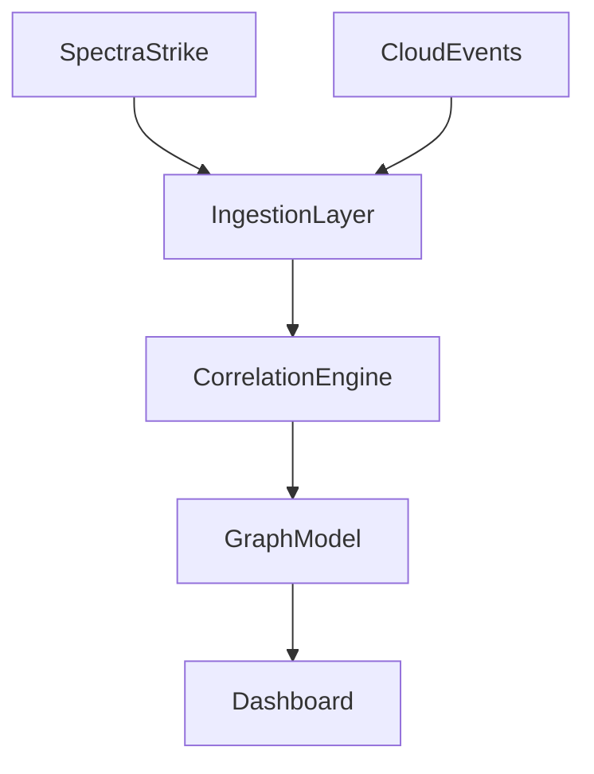

# VectorVue Documentation

## VectorVue — Continuous Security Validation Infrastructure

VectorVue ingests signed telemetry from offensive validation systems, normalizes and correlates evidence, and delivers continuous assurance views for engineering, security, and governance stakeholders.

## System Overview

## Core Sections

- [Overview]({{ '/' | relative_url }})
- [Telemetry Architecture]({{ '/telemetry-architecture/' | relative_url }})
- [Federation Layer]({{ '/federation-layer/' | relative_url }})
- [Correlation Engine]({{ '/correlation-engine/' | relative_url }})
- [Continuous Validation]({{ '/continuous-validation/' | relative_url }})
- [API & SDK]({{ '/api-sdk/' | relative_url }})
- [Deployment Modes]({{ '/deployment-modes/' | relative_url }})
- [Integration Guides]({{ '/integration-guides/' | relative_url }})
- [Diagrams]({{ '/diagrams/' | relative_url }})

## Cross Product Links

- [SpectraStrike Docs](https://docs.spectrastrike.nyxera.cloud)
- [Nyxera Nexus Docs](https://nyxera-nexus.nyxera.cloud)
- [Nyxera Cloud](https://nyxera.cloud)
