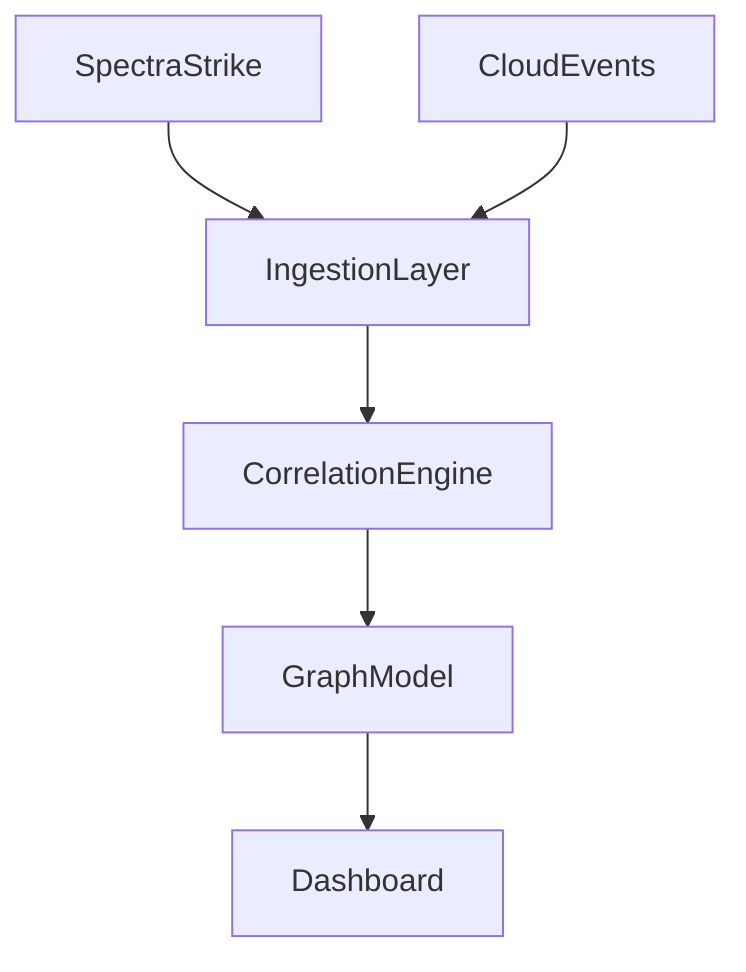

<!-- NYXERA_BRANDING_HEADER_START -->

  

  <a href="https://docs.vectorvue.nyxera.cloud">Docs</a> |
  <a href="https://vectorvue.nyxera.cloud">VectorVue</a> |
  <a href="https://nexus.nyxera.cloud">Nexus</a> |
  <a href="https://nyxera.cloud">Nyxera Labs</a>

<!-- NYXERA_BRANDING_HEADER_END -->

# VectorVue Documentation

## VectorVue — Continuous Security Validation Infrastructure

VectorVue ingests signed telemetry from offensive validation systems, normalizes and correlates evidence, and delivers continuous assurance views for engineering, security, and governance stakeholders.

## System Overview

```mermaid
flowchart TD
SpectraStrike --> IngestionLayer
CloudEvents --> IngestionLayer
IngestionLayer --> CorrelationEngine
CorrelationEngine --> GraphModel
GraphModel --> Dashboard
```

## Core Sections

- [Overview]({{ '/' | relative_url }})
- [Telemetry Architecture]({{ '/telemetry-architecture/' | relative_url }})
- [Federation Layer]({{ '/federation-layer/' | relative_url }})
- [Correlation Engine]({{ '/correlation-engine/' | relative_url }})
- [Continuous Validation]({{ '/continuous-validation/' | relative_url }})
- [API & SDK]({{ '/api-sdk/' | relative_url }})
- [Deployment Modes]({{ '/deployment-modes/' | relative_url }})
- [Integration Guides]({{ '/integration-guides/' | relative_url }})
- [Diagrams]({{ '/diagrams/' | relative_url }})

## Cross Product Links

- [SpectraStrike Docs](https://docs.spectrastrike.nyxera.cloud)
- [Nyxera Nexus Docs](https://docs.nexus.nyxera.cloud)
- [Nyxera Cloud](https://nyxera.cloud)

<!-- NYXERA_BRANDING_FOOTER_START -->

---

  

  2026 VectorVue by Nyxera Labs. All rights reserved.

  <a href="https://docs.vectorvue.nyxera.cloud">Docs</a> |
  <a href="https://vectorvue.nyxera.cloud">VectorVue</a> |
  <a href="https://nexus.nyxera.cloud">Nexus</a> |
  <a href="https://nyxera.cloud">Nyxera Labs</a>

<!-- NYXERA_BRANDING_FOOTER_END -->
